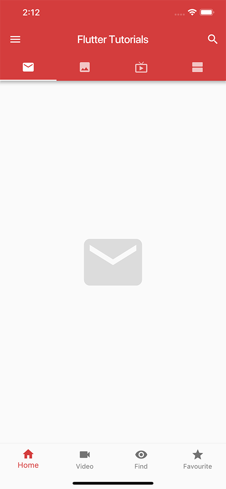
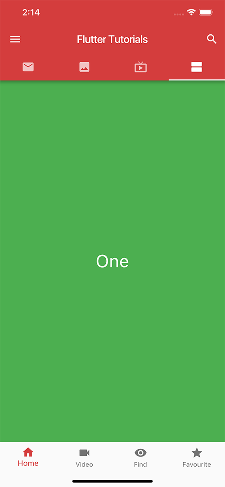

# flutter_tutorials

一个包含各种示例的 Flutter 项目

## 运行

前提是你的 Flutter 环境已经搭建好了，Flutter 环境搭建请参考 [https://flutter.io/get-started/install/](https://flutter.io/get-started/install/)

```bash
git clone git@github.com:wangchi/flutter_tutorials.git
cd flutter_tutorials
flutter run∏
```

## 部分截图






## LICENSE

[MIT LICENSE](https://wangchi.mit-license.org/)
